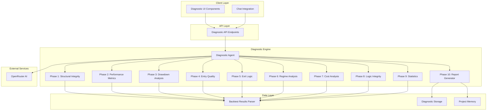

# Quantitative Backtest Diagnostic Agent - Architecture Plan

## Overview

This document outlines the architecture and implementation plan for a production-grade Quantitative Backtest Diagnostic Agent system. The agent performs rigorous, evidence-based diagnostics on Freqtrade backtest results to identify root causes of unprofitability or underperformance.

## System Architecture



## Phase 1: Structural Integrity & Pre-Analysis

### Purpose
Fail-fast gate to rule out structural invalidation before proceeding to performance analysis.

### Data Requirements
- Backtest results JSON (trades, results, strategy config)
- Strategy file content (optional)
- (Optional/Future) Price data (OHLCV) for candle-level continuity checks

### Checks Performed

#### 1.1 Data Continuity
```typescript
interface DataContinuityCheck {
  hasMissingBars: boolean;
  gapCount: number;
  largestGapMinutes: number;
  timestampSequenceValid: boolean;
  verdict: 'PASS' | 'FAIL';
  details: string;
}
```

**Implementation:**
- Parse trade timestamps
- Check for gaps > 2x timeframe (heuristic, based on trade timestamps)
- Validate chronological order
- Detect duplicate timestamps

#### 1.2 Look-Ahead Bias Detection
```typescript
interface LookAheadBiasCheck {
  hasLookAheadBias: boolean;
  detectedIndicators: string[];
  suspiciousConditions: string[];
  verdict: 'PASS' | 'FAIL';
  details: string;
}
```

**Implementation:**
- Parse strategy file
- Identify indicator calculations
- Check for future data references
- Validate signal timing

#### 1.3 Logic Feasibility
```typescript
interface LogicFeasibilityCheck {
  hasImpossibleConditions: boolean;
  conflictingRules: string[];
  mutuallyExclusiveConditions: string[];
  verdict: 'PASS' | 'FAIL';
  details: string;
}
```

**Implementation:**
- Parse entry/exit conditions
- Check for logical contradictions
- Validate condition achievability

### Output
If any check fails, diagnostic stops with structural failure report.

## Phase 2: Mathematical Performance Diagnostics

### Purpose
Calculate core performance metrics and identify mathematical causes of unprofitability.

### Data Requirements
- Trade list with profit/loss data
- Win/loss counts
- Average win/loss amounts

### Metrics Calculated

#### 2.1 Expectancy Breakdown
```typescript
interface ExpectancyAnalysis {
  winRate: number;           // Percentage
  avgWin: number;           // Average profit per winning trade
  avgLoss: number;          // Average loss per losing trade
  lossRate: number;          // Percentage
  expectancy: number;        // (WinRate × AvgWin) − (LossRate × AvgLoss)
  diagnosis: string;
  redFlags: string[];
}
```

**Diagnosis Logic:**
- WinRate > 50% && Expectancy < 0 → Loss magnitude problem
- High AvgWin && Low WinRate → Entry timing issue
- Both poor → Signal quality failure

#### 2.2 Trade Distribution Analysis
```typescript
interface TradeDistribution {
  totalTrades: number;
  tradesPerDay: number;
  longCount: number;
  shortCount: number;
  longShortRatio: number;
  capitalDeployedPct: number;
  avgTimeInMarket: number;  // Hours
  redFlags: string[];
}
```

**Red Flags:**
- Total trades < 30 → Over-filtering
- Trades per day > 50 → Noise trading
- Always in market → High exposure risk

## Phase 3: Drawdown & Risk Failure Analysis

### Purpose
Analyze drawdown structure and validate risk management execution.

### Data Requirements
- Equity curve data
- Trade list with stop loss data
- Drawdown periods

### Metrics Calculated

#### 3.1 Drawdown Structure
```typescript
interface DrawdownAnalysis {
  maxDrawdown: number;           // Percentage
  maxDrawdownAbs: number;        // Currency amount
  avgDrawdownDuration: number;    // Hours
  maxDrawdownDuration: number;    // Hours
  timeToRecovery: number;        // Hours
  equityCurveSlope: number;       // Trend
  drawdownCount: number;
  failurePatterns: string[];
}
```

**Failure Patterns:**
- Long flat recovery → Weak exits
- Steep vertical drops → Stop-loss failure
- Multiple frequent DDs → Regime mismatch

#### 3.2 Risk Per Trade Validation
```typescript
interface RiskPerTradeAnalysis {
  actualRiskPct: number;
  worstLoss: number;
  expectedStopLoss: number;
  stopLossRespectedPct: number;
  avgSlippage: number;
  positionSizingIssue: boolean;
  redFlags: string[];
}
```

**Detection:**
- Stops not respected (gaps or logic errors)
- Stops too wide vs targets
- Position sizing amplifying losses

## Phase 4: Entry Quality Diagnostics

### Purpose
Analyze losing trades to identify entry timing and context issues.

### Data Requirements
- Trade list with entry/exit data
- Price data for entry context
- Indicator values at entry time

### Analysis Performed

#### 4.1 Entry Context Classification (LOSING TRADES ONLY)
```typescript
interface EntryContext {
  trendAlignment: 'trend-following' | 'counter-trend' | 'neutral';
  volatilityRegime: 'low' | 'normal' | 'high' | 'expansion';
  oscillatorState: 'oversold' | 'overbought' | 'neutral';
  marketRegime: 'trending' | 'ranging' | 'volatile';
  fallingKnifeDetected: boolean;
}
```

**Classification Logic:**
- Trend: EMA slope at entry
- Volatility: ATR percentile
- Oscillators: RSI/MACD values
- Regime: ADX + price action

#### 4.2 Entry Timing & Slippage
```typescript
interface EntryTimingAnalysis {
  immediateAdverseMovePct: number;  // Trades going negative immediately
  avgSlippagePips: number;
  lateEntryCount: number;
  confirmationDelayMs: number;
  diagnosis: string;
}
```

**Diagnosis:**
- Majority negative immediately → Late entry
- High slippage → Lagging indicators

## Phase 5: Exit Logic Autopsy

### Purpose
Analyze exit reasons and compare winner vs loser duration.

### Data Requirements
- Trade list with exit reasons
- Trade durations
- Profit/loss per exit type

### Analysis Performed

#### 5.1 Exit Reason Attribution
```typescript
interface ExitReasonAnalysis {
  exitTypes: {
    stopLoss: { count: number; totalPnL: number; avgPnL: number };
    roiTarget: { count: number; totalPnL: number; avgPnL: number };
    trailingStop: { count: number; totalPnL: number; avgPnL: number };
    forceExit: { count: number; totalPnL: number; avgPnL: number };
    timeout: { count: number; totalPnL: number; avgPnL: number };
  };
  conclusions: string[];
}
```

**Conclusions:**
- ROI profitable, stops catastrophic → Stop placement illogical
- Trailing stops killing winners → Distance too tight
- Timeout exits negative → No edge after time X

#### 5.2 Winner vs Loser Duration
```typescript
interface DurationComparison {
  avgWinnerDuration: number;    // Hours
  avgLoserDuration: number;     // Hours
  durationRatio: number;          // Loser/Winner
  antiPatterns: string[];
}
```

**Anti-Patterns:**
- Losers held longer → Emotional holding
- Winners exited too fast → Cutting profits short

## Phase 6: Market Regime & Asset Analysis

### Purpose
Segment performance by market conditions and assets.

### Data Requirements
- Trade list with timestamps
- Price data for regime calculation
- Asset/pair information

### Analysis Performed

#### 6.1 Regime Segmentation
```typescript
interface RegimeSegmentation {
  segments: {
    trendStrength: 'weak' | 'moderate' | 'strong';
    volatility: 'low' | 'normal' | 'high';
    tradingSession: 'Asia' | 'London' | 'NY' | 'Overlap';
    marketPhase: 'bull' | 'bear' | 'range';
    trades: number;
    totalPnL: number;
    winRate: number;
    maxDD: number;
  }[];
  profitableRegimes: string[];
  unprofitableRegimes: string[];
  diagnosis: string;
}
```

**Key Question:** Does strategy profit in only one regime while bleeding in others?

#### 6.2 Asset Contribution Analysis
```typescript
interface AssetAnalysis {
  assets: {
    pair: string;
    totalPnL: number;
    maxDD: number;
    winRate: number;
    tradeCount: number;
    contributionPct: number;
  }[];
  paretoInefficiency: {
    top20LossAssets: string[];
    lossContributionPct: number;
  };
  recommendations: string[];
}
```

**Red Flags:** Pareto inefficiency (20% of assets cause 80% of losses)

## Phase 7: Fee, Slippage & Reality Check

### Purpose
Stress test profitability with increased costs and validate liquidity.

### Data Requirements
- Trade list with fee data
- Order sizes
- Market volume data

### Analysis Performed

#### 7.1 Cost Sensitivity Stress Test
```typescript
interface CostSensitivityAnalysis {
  originalProfit: number;
  with25pctMoreFees: number;
  with50pctMoreSlippage: number;
  combinedStress: number;
  edgeViable: boolean;
  verdict: string;
}
```

**Verdict:** If profitability vanishes, edge is too thin for live trading.

#### 7.2 Liquidity & Volume Analysis
```typescript
interface LiquidityAnalysis {
  avgOrderSize: number;
  avgMarketVolume: number;
  orderToVolumeRatio: number;
  unrealisticFills: boolean;
  liquidityRisk: 'low' | 'medium' | 'high';
}
```

**Flag:** "Backtest assumes perfect fills" if order sizes exceed realistic liquidity.

## Phase 8: Strategy Logic Integrity

### Purpose
Detect logical contradictions and overfitting in strategy code.

### Data Requirements
- Strategy file content
- Indicator list
- Parameter values

### Analysis Performed

#### 8.1 Signal Conflict Detection
```typescript
interface SignalConflictAnalysis {
  conflictingIndicators: string[];
  briefSignalInstability: boolean;
  impossibleCycles: string[];
  logicErrors: string[];
}
```

**Detection:**
- Multiple indicators giving opposing signals
- Entry conditions satisfied only briefly
- Impossible entry/exit cycles

#### 8.2 Overfitting & Complexity
```typescript
interface OverfittingAnalysis {
  indicatorCount: number;
  highlyCorrelatedIndicators: string[];
  magicParameters: string[];
  complexityScore: number;  // 0-100
  overfittingRisk: 'low' | 'medium' | 'high';
}
```

**Heuristics:**
- >5 indicators → Diminishing returns
- Highly correlated signals → Redundant logic
- Magic numbers (e.g., RSI period 17) → No statistical basis

## Phase 9: Statistical Robustness

### Purpose
Validate sample adequacy and calculate confidence intervals.

### Data Requirements
- Trade count
- Variance data
- Expectancy calculation

### Analysis Performed

#### 9.1 Sample Adequacy
```typescript
interface SampleAdequacyAnalysis {
  tradeCount: number;
  minRequiredTrades: number;
  expectancy: number;
  expectancyStdDev: number;
  confidenceInterval95: [number, number];
  variance: number;
  verdict: 'PASS' | 'FAIL';
  justification: string;
}
```

**Fail Conditions:**
- N < 30 → Statistically meaningless
- High variance → Unstable edge
- Wide confidence interval → Low confidence

## Phase 10: Final Diagnostic Output

### Purpose
Generate strictly formatted diagnostic report.

### Output Format
```typescript
interface DiagnosticReport {
  metadata: {
    reportId: string;
    timestamp: string;
    backtestId: string;
    strategy: string;
    timeframe: string;
    timerange: string;
  };

  phase1: {
    structuralIntegrity: {
      verdict: 'PASS' | 'FAIL';
      dataContinuity: DataContinuityCheck;
      lookAheadBias: LookAheadBiasCheck;
      logicFeasibility: LogicFeasibilityCheck;
    };
  };

  phase2: {
    performanceMetrics: {
      expectancy: ExpectancyAnalysis;
      tradeDistribution: TradeDistribution;
    };
  };

  phase3: {
    drawdownAnalysis: {
      drawdownStructure: DrawdownAnalysis;
      riskPerTrade: RiskPerTradeAnalysis;
    };
  };

  phase4: {
    entryQuality: {
      entryContext: EntryContext[];
      entryTiming: EntryTimingAnalysis;
    };
  };

  phase5: {
    exitLogic: {
      exitReasons: ExitReasonAnalysis;
      durationComparison: DurationComparison;
    };
  };

  phase6: {
    regimeAnalysis: {
      regimeSegmentation: RegimeSegmentation;
      assetAnalysis: AssetAnalysis;
    };
  };

  phase7: {
    costAnalysis: {
      costSensitivity: CostSensitivityAnalysis;
      liquidity: LiquidityAnalysis;
    };
  };

  phase8: {
    logicIntegrity: {
      signalConflicts: SignalConflictAnalysis;
      overfitting: OverfittingAnalysis;
    };
  };

  phase9: {
    statisticalRobustness: {
      sampleAdequacy: SampleAdequacyAnalysis;
    };
  };

  // Final Summary (STRICT FORMAT)
  summary: {
    primaryLossDriver: string;
    secondaryIssue: string;
    regimeFailure: string;
    assetRisk: string;
    statisticalVerdict: 'PASS' | 'FAIL';
    suggestedFixes: string[];
  };
}
```

## Implementation Plan

### File Structure
```
server/
  utils/
    backtest-diagnostic/
      parser.ts                  # Reads user_data/backtest_results/backtest-result-<backtestId>.json
      types.ts                   # Shared diagnostic report interfaces (server-side)
      phase1-structural.ts        # Phase 1 implementation (current)
      phase2-performance.ts       # Phase 2 implementation (current)
      phase3-drawdown.ts         # Phase 3 implementation
      phase4-entry.ts            # Phase 4 implementation
      phase5-exit.ts             # Phase 5 implementation
      phase6-regime.ts           # Phase 6 implementation
      phase7-costs.ts           # Phase 7 implementation
      phase8-logic.ts            # Phase 8 implementation
      phase9-statistics.ts        # Phase 9 implementation
      phase10-report.ts          # Phase 10 implementation
      indicators.ts              # Indicator calculations
      regime-detector.ts         # Market regime detection

  storage.ts                    # DatabaseStorage (stores backtests + diagnostic_reports)

shared/
  diagnostic.ts                 # Shared types and interfaces

client/
  src/
    components/
      diagnostic/
        DiagnosticReportView.tsx # Renders the diagnostic report (current)
      BacktestResults.tsx        # Calls /api/diagnostic/analyze and displays DiagnosticReportView
```

### API Endpoints

```typescript
// POST /api/diagnostic/analyze
// Analyze a backtest result and generate + persist a diagnostic report.
// NOTE: In the current app, backtest results are keyed by DB backtest id,
// and parsed from user_data/backtest_results/backtest-result-<backtestId>.json.
interface AnalyzeRequest {
  backtestId: number;
  strategyPath?: string;
}

// Current implementation returns the full report JSON.
// (No async processing status wrapper yet.)
type AnalyzeResponse = DiagnosticReport;

// GET /api/diagnostic/reports/:backtestId
// Return stored diagnostic reports for a given DB backtest id.
// (DB rows from diagnostic_reports table.)
type ListReportsResponse = Array<{
  id: number;
  reportId: string;
  backtestId: number | null;
  strategy: string | null;
  timeframe: string | null;
  timerange: string | null;
  report: DiagnosticReport;
  createdAt: string | null;
}>;

// NOTE: These diagnostic endpoints are currently implemented directly in server/routes.ts
// and are not yet part of the shared API contract in shared/routes.ts.
```

### Integration with Chat System

The diagnostic agent will be integrated as a specialized tool in the chat system:

```typescript
// In the current app, the chat system can trigger diagnostics by calling
// POST /api/diagnostic/analyze with a DB backtest id.
const diagnosticTool = {
  name: 'analyze_backtest',
  description: 'Run the diagnostic pipeline for an existing backtest run',
  parameters: {
    backtestId: { type: 'number', required: true },
    strategyPath: { type: 'string', required: false },
  },
  execute: async (params) => {
    const resp = await fetch('/api/diagnostic/analyze', {
      method: 'POST',
      headers: { 'Content-Type': 'application/json' },
      body: JSON.stringify({
        backtestId: params.backtestId,
        strategyPath: params.strategyPath,
      }),
    });
    if (!resp.ok) throw new Error('Diagnostic analyze failed');
    return await resp.json();
  },
};
```

### Storage Schema

```typescript
// Current implementation (shared/schema.ts)
export const diagnosticReports = pgTable("diagnostic_reports", {
  id: serial("id").primaryKey(),
  reportId: text("report_id").notNull().unique(),
  backtestId: integer("backtest_id").references(() => backtests.id),
  strategy: text("strategy"),
  timeframe: text("timeframe"),
  timerange: text("timerange"),
  report: jsonb("report").notNull(),
  createdAt: timestamp("created_at").defaultNow(),
});
```

## Multi-Agent Loop Integration

This diagnostic agent is Agent #1 in the multi-agent loop:

```
[Diagnostic Agent] → Analyzes backtest, identifies issues
        ↓
[Fix Design Agent] → Designs fixes based on diagnostic report
        ↓
[Implementation Agent] → Implements the fixes
        ↓
[Backtest] → Runs new backtest
        ↓
[Validation Agent] → Validates improvements
```

### Agent Handoff Protocol

```typescript
interface AgentHandoff {
  fromAgent: 'diagnostic' | 'fix-design' | 'implementation' | 'validation';
  toAgent: 'fix-design' | 'implementation' | 'validation' | 'diagnostic';
  context: {
    diagnosticReport?: DiagnosticReport;
    fixDesign?: FixDesign;
    implementation?: ImplementationResult;
    validationResult?: ValidationResult;
  };
  timestamp: string;
}
```

## Key Design Principles

1. **Fail Fast:** Phase 1 stops execution if structural issues detected
2. **Evidence-Based:** All conclusions must be backed by data
3. **No Guessing:** Explicitly state what cannot be concluded
4. **Causality:** Fixes must be causally linked to identified issues
5. **Production-Safe:** Assume real capital deployment
6. **Single Responsibility:** Each phase has one clear purpose

## Testing Strategy

1. **Unit Tests:** Each phase independently tested
2. **Integration Tests:** Full diagnostic workflow tested
3. **Edge Cases:** Missing data, corrupt files, edge conditions
4. **Performance:** Large backtest files (>10MB)
5. **Accuracy:** Compare against known good/bad strategies

## Success Criteria

- All 10 phases implemented and tested
- Diagnostic reports generated in <30 seconds for typical backtests
- Reports identify correct root causes in test cases
- Integration with chat system functional
- UI displays reports clearly and accurately
- Storage and retrieval of reports working
- Multi-agent loop handoff protocol implemented

## Next Steps

1. Implement Phase 1 (Structural Integrity) - highest priority
2. Create backtest results parser
3. Implement remaining phases sequentially
4. Build API endpoints
5. Create UI components
6. Integrate with chat system
7. Test end-to-end workflow
8. Document usage and API
